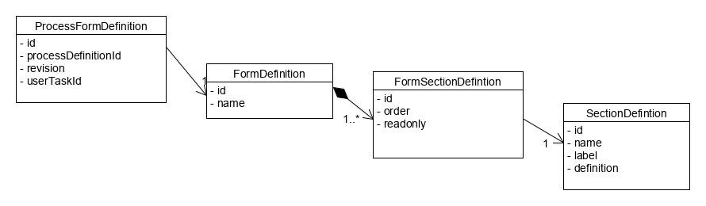

# I - Intégration de la facette BPMN

La facette manipule les concepts suivants :

* _ProcessDefinition_  la modélisation du processus. Il peut exister plusieurs versions d'un même processus
* _Task_  l'instantiation d'un processus 
* _AssetDefinition_  l'objet métier sur lequel porte une tâche
* _Form_  le formulaire associé à une étape utilisateur
* _Action_  l'action utilisateur réalisable à un étape utilisateur

L'intégration de la facette BPMN nécessite les développements suivants :

* Créer l'entité supportant le workflow (par exemple un Projet) en étendant la classe  _AbstractAssetDescriptionEntity_
* Modéliser dans swagger le DTO associé en héritant de la classe  _AssetDescription_
* Créer l'interface du DAO pour l'entité concernée en implémentant l'interface  _AssetDescriptionDao_
* Créer le mapper pour le couple entité/dto en étendant l'interface  _AssetDescriptionMapper_
* Etendre (si nécessaire) la classe _TaskSearchCriteria_  pour ajouter les critères nécessaires à l'affichage de la banette
* Etendre la classe abstraite  _AbstractTaskServiceImpl_  pour le DTO et le TaskSearchCriteria
* Etendre la classe  _AbstractWorkflowContext_  pour ajouter les méthodes utilitaires propres au context métier
* Etendre la classe  _AbstractAssignmentHelper_  pour définir les modalités d'affectation des utilisateurs
* Etendre la casses  _AbstactAssetDescriptionHelper_  pour spécialiser ce helper vis à vis du mapper créé

# II - Design des processus

## II.1 - Créer un processus dans la base

Le seul moyen de créer un nouveau processus ou une nouvelle version d'un processus est d'utiliser la méthode  _InitializationService.updateProcessDefinition_  en passant le fichier *.bpmn20.xml (Attention de bien respecter l'extension).

Pour lister les processus déclarés (avec les différentes versions):  _InitializationService.searchProcessDefinitions_ 

## II.2 - Bien modéliser

Pour bien modéliser un processus, il est recommandé à chaque étape, de mettre à jour les données de l'Asset correspondant et notamment :
* son état '_Activiti_'
* son état fonctionnelle
* la date de mise à jour
Des méthodes utilitaires sont disponibles pour cela (Cf. ci-dessous)

## II.3 - Interactions des processus avec l'Asset

La classe WorkflowContext propose un certain nombre de méthodes utilitaires :

* Les logs

```java
workflowContext.log(message);
```

* La mise à jour des données
Cette appel permet de modifier l'état du signalement et de mettre à jour la dernière date de modification.

```java
workflowContext.updateStatus(context, execution, "PENDING");
```
* Les mails

L'envoie de courriel commence par la création d'un objet EMailData.
Le construction d'EMailData prend 2 paramètres :
* Le sujet
* Le corps du courriel

Si le corps du courriel commence par `stl:`, il est considéré comme inline et le template correspondant sera chargé.
Si le corps du courriel commence par `file:`, il est considéré comme un fichier et le template correspondant sera chargé.

Le fonctinnement est celui de la facette  _generator-text_..

```java
var localEmailData = new org.rudi.facet.bpmn.bean.workflow.EMailData("Création d'une demande", "file:initiator-mail.html");
```

Ensuite l'appel suivant envoie un courriel à l'initiateur du signalement avec le sujet et le corps contenu dans l'objet EMailData

```java
workflowContext.sendEMail(context,execution,localEmailData);
```

* L'assignation à une personne

Ce type d'assignation se fait en utilisant la balise `humanPerformer`

```xml
 <bpmn:humanPerformer id="HumanPerformer_1" name="Human Performer 1">
        <bpmn:resourceAssignmentExpression id="ResourceAssignmentExpression_3">
          <bpmn:formalExpression id="FormalExpression_3" evaluatesToTypeRef="ItemDefinition_1" language="http://www.java.com/java">
          	[...]
          </bpmn:formalExpression>
        </bpmn:resourceAssignmentExpression>
      </bpmn:humanPerformer>
```

L'expression formelle doit retourner un chaine de caractère correspond à un identifiant d'utilisateur.
L'objet `worfkflowContext` propose la méthode suivante : 

```java
${workflowContext.computeHumanPerformer(null,execution,"Validator", "Nouvel asset", "file:assignee-mail.html")}
```

Les paramètres de la méthode sont :
* null (paramètre pour compabitilité)
* execution (paramètre implicite)
* Le nom du rôle correspondant
* Le sujet du courriel
* Le corps du courriel


* L'assignation à un groupe ou une liste de personnes

Ce type d'assignation se fait en utilisant la balise `potentialOwner`

```xml
      <bpmn:potentialOwner id="PotentialOwner_1" name="Potential Owner 1">
        <bpmn:resourceAssignmentExpression id="ResourceAssignmentExpression_4">
          <bpmn:formalExpression id="FormalExpression_8" language="http://www.java.com/java">
          	[...]
          </bpmn:formalExpression>
        </bpmn:resourceAssignmentExpression>
      </bpmn:potentialOwner>
```

L'expression formelle peut contenir une liste de valeurs séparées par des virgules.
Chaque valeur peut être de la forme `user(<expression>)` ou `group(<expression>)`.
dans le premier car, l'expression est un `candidateUser` dans le second l'expression est un `candidateGroup`. 

L'objet `worfkflowContext` propose la méthode suivante : 

```java
user(${workflowContext.computePotentialOwners(null,execution,"Validator", "Nouvel asset", "file:assignee-mail.html")})
```
Les paramètres de la méthode sont :
* null (paramètre pour compabitilité)
* execution (paramètre implicite)
* Le nom du rôle correspondant
* Le sujet du courriell
* Le corps du courriel

# III - Configuration des champs de formulaire d'une étape



Il est possible d'associer un formulaire à une étape utilisateur sous la forme d'un _FormDefinition_ au moyen de la classe _ProcessFormDefinition_.
Si aucune version n'est précisée (_version = null_), toutes les versions sont impactées.

Chaque formulaire est associé à une liste de sections par le biais de la classe _FormSectionDefintion_.
Cette classe de liaison permet de définir :
* l'ordre d'affichage grâce aux champ order
* si la section est en lecture seule pour ce formulaire (par exemple pour afficher le commentaire d'une étape précédente non modifiable).

Chaque section possède (_SectionDefintion_):
* un nom unique, 
* un libellé,
* une définition sous le forme d'un flux json.

Le flux json est constitué comme suit:

```json
{
	"fieldDefinitions": [
		{
			"name": <string>,
			"label": <string>,
			"type": (
			"STRING"
			|
			"BOOLEAN"
			|
			"LONG"
			|
			"DOUBLE"
			|
			"LIST"
			),
			"readOnly": false
			|
			true,
			"required": false
			|
			true,
			"multiple": false
			|
			true,
			"extendedType": "<flux json d'une liste d'objet avec code et label>",
			"validators": [
				{
					"type": (
					"MAXLENGTH"
					|
					"POSITIVE"
					|
					"NEGATIVE"
					),
					"attribute": (
					"<integer pour maxlength>"
					|
					null)
				}
			]
		},
		...
	]
}
```

## Initialisation automatique

Pour associer automatiquement des formulaires à des étapes, il suffit d'ajouter les définitions JSON dans les dossiers
suivants dans le classpath :

- `bpmn/forms` : pour définir des formulaires qui utilisent les sections définies juste après
- `bpmn/sections` : pour définir des sections

Le nommage des fichiers de formulaires doit être composé des éléments suivants séparés par `__` :

- processDefinitionId
- userTaskId (`draft` dans le cas d'un formulaire draft)
- actionName (optionnel)

On peut spécifier un label pour une section si on souhaite qu'elle soit matérialisée par une bordure côté front.

Exemple de définition avant la RUDI-2605 :

- bpmn
    - forms
        - [linked-dataset-process__UserTask_1__canceled.json](src/test/resources/bpmn/forms/linked-dataset-process__UserTask_1__canceled.json)
    - sections
        - [linked-dataset-process__UserTask_1__canceled.json](src/test/resources/bpmn/sections/linked-dataset-process__UserTask_1__canceled.json)

Exemple de définition après la RUDI-2605 :

- bpmn
    - forms
        - [information-request-process__draft.json](src/test/resources/bpmn/forms/information-request-process__draft.json)
    - sections
        - [matching-data.json](src/test/resources/bpmn/sections/matching-data.json)
        - [consent.json](src/test/resources/bpmn/sections/consent.json)
        - [data-access.json](src/test/resources/bpmn/sections/data-access.json)
