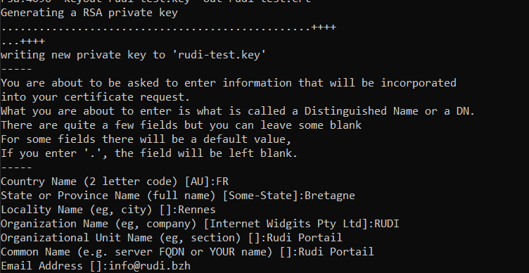

## I - Intégration de la facette Generator PDF

La facette met à disposition un service de conversion de fichiers docx en pdf et de signature des pdfs

L'ajout de la facette requière de compléter dans la classe _AppFacadeApplication_ la liste des packages scannés :

> @SpringBootApplication(scanBasePackages = { "org.rudi.facet.generator.pdf" ...})

Cette facette comporte les services suivants :

- PDFConvertor pour la conversion des fichiers docx en PDF ou des PDF en PDF/A
- PDFSigner pour la signature de PDFs

## II - Signature des PDFs

Pour la signature des PDF, il est nécessaire de mettre en place un coffre-fort de certificat contenant un certificat avec sa chaine de certification.
En conséquence, les propriétés à configurer pour la signature des PDFs sont :

* `rudi.pdf.sign.keyStorePath` : le chemin d'accès du coffre-fort
* `rudi.pdf.sign.keyStorePassword` : le mot de passe du coffre-fort
* `rudi.pdf.sign.keyStoreKeyAlias` : l'alias de la clé de chiffrement dans le KeyStore
* `rudi.pdf.sign.keyStoreKeyPassword` :  mot de passe de l'alias de la clé de chiffrement dans le KeyStore

En complément la propriété suivante peut-être configurée :
* `rudi.pdf.sign.keyStoreType` : type de KeyStore (par défaut ```JKS```)

#### Création du coffre-fort (```keystore```) "rudi-test"


1. Création d'un certificat et de sa clé
2. Création d'un fichier portable contenant le certificat et la clé
3. Import dans le keystore


###### Création d'un certificat 

> openssl req -x509 -sha256 -nodes -newkey rsa:4096 -keyout rudi-test.key -out rudi-test.crt

Au prompt de cette commande les éléments suivants sont saisis :



###### Création d'un fichier portable contenant le certificat et la clé

> cat /etc/ssl/certs/ca-certificates.crt rudi-test.crt > ca-certs.pem

> openssl pkcs12 -export -in rudi-test.crt -inkey rudi-test.key -chain -CAfile ca-certs.pem -name "rudi-test" -out rudi.p12

###### Import dans un fichier java keyStore de type PKCS12

> keytool -importkeystore -deststorepass ruditest -destkeystore rudi-test.jks -srckeystore rudi.p12 -srcstoretype PKCS12

Le mot de passe du KeyStore de test est ```ruditest``` 

###### Lister le contenu du coffre-fort "rudi-test"

La ligne de commande pour lister les éléments d'un coffre-fort est :

> keytool -list -keystore <key store name>.jks

> keytool -list -keystore <key store name>.jks -alias <rudi alias name>

> keytool -list -keystore <key store name>.jks -alias <rudi alias name> -rfc


## III - Conversion en PDF/A

La conversion en PDF/A doit respecter un certain nombre de pré-requis décrits par exemple ici https://fr.wikipedia.org/wiki/PDF/A

Il est possible de vérifier la conformité d'un PDF/A par exemple ici https://tools.pdfforge.org/fr/valider-pdfa

Mais il est aussi possible d'utiliser le service _PDFConverter_ pour valider la conformité du PDF/A.

La facette prend en charge les éléments suivants :

- Toutes les polices (de caractères) doivent être intégrées au fichier du document et doivent pouvoir être intégrées légalement aussi pour un rendu universel et non limité. Cela s'applique aussi aux polices dites PostScript standard telles que Times ou Helvetica.
- Les espaces de couleur spécifiés de manière indépendante du périphérique.
- L'utilisation de métadonnées normalisées est requise

En revanche les autres éléments tels que l'interdiction des contenus audio et video, les fichiers tiers, etc doivent être anticipé par le producteur du document PDF source.

De manière interne le service de conversion utilise Ghostscrit pour traiter les éléments relatifs aux polices de caractères et PDFBox pour le traitement des métadonnées et des espaces de couleurs.

Il est donc nécessaire :

- d'installer ghostscript
- de configurer la facette pour indiquer où se trouve la librairie ghostscript (dll ou so)

Pour cette derniere étape, il est possible de passer :

> -Djava.library.path="C:/Projets/workspace-rm-rudi/gs/gs10.00.0/bin" 

ou 

> -Djna.library.path="C:/Projets/workspace-rm-rudi/gs/gs10.00.0/bin"


